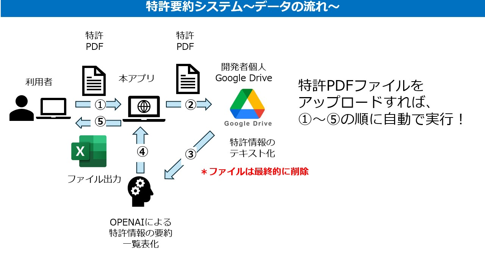
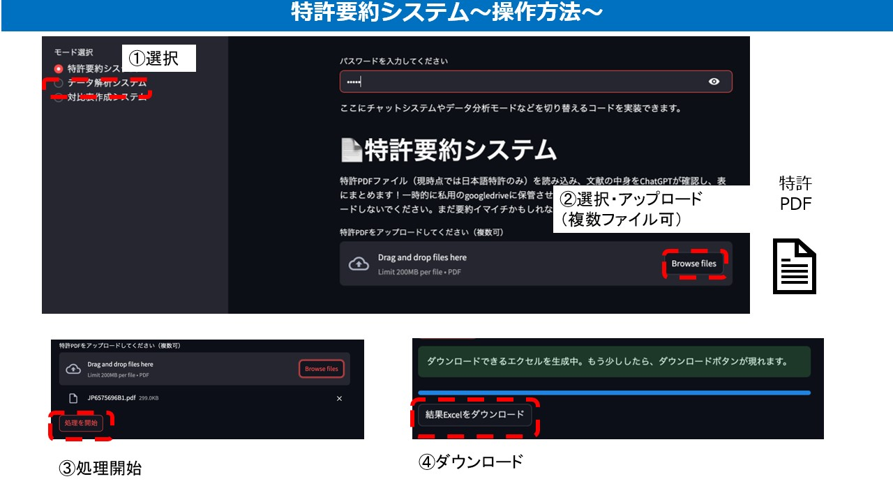
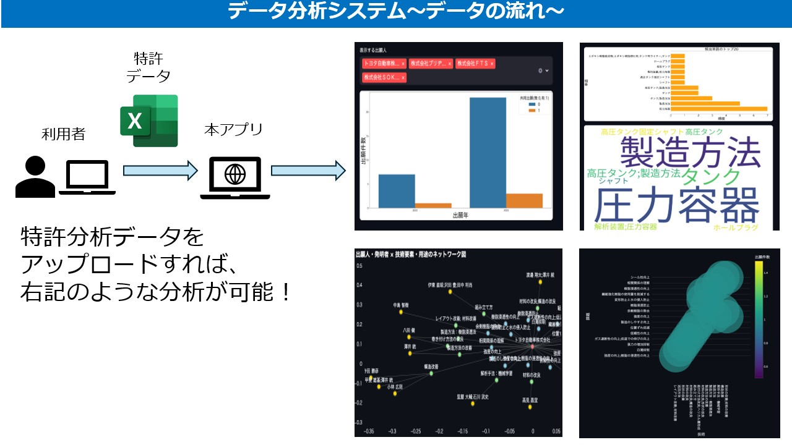
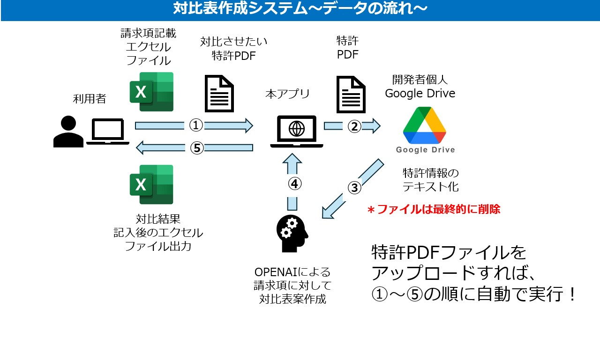
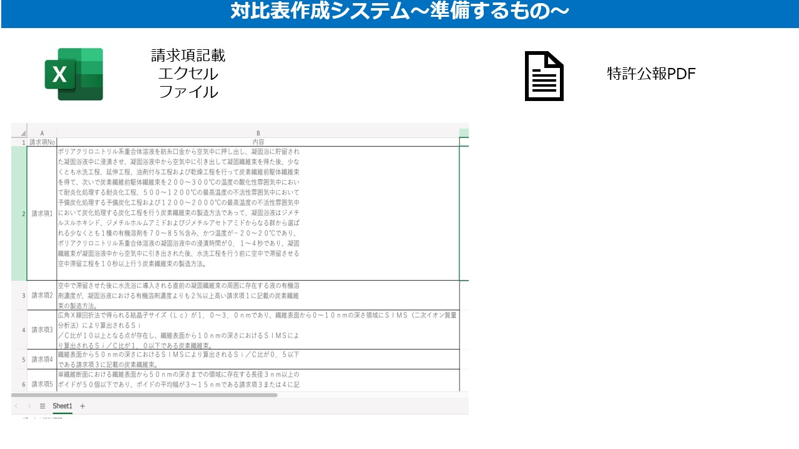
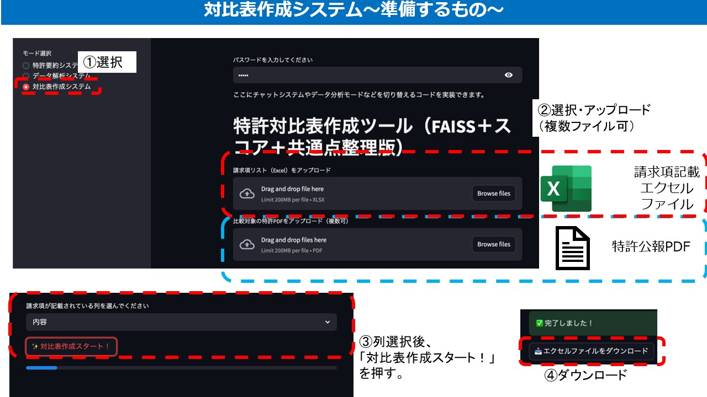

# 🎯 Catch_App - 特許PDFの多言語要約アプリ（LLM × Streamlit）
特許分析用webアプリケーション第２弾

特許PDF（日本語・英語・中国語・韓国語）をアップロードするだけで、ChatGPT（OpenAI API）を活用して自動的に「タイトル・要約・請求項」を日本語で出力します。  
特許分析の業務効率を飛躍的に高める、実務者のためのアプリです。

---

## 🔧 主な機能一覧

| 機能 | 説明 |
|------|------|
| 📄 PDFアップロード | 特許文献（.pdf）を直接アップロード |
| 🌐 多言語判定 | 自動的に原文の言語を検出（例：EN, ZH, KO） |
| 🔁 自動翻訳＋要約 | ChatGPT APIを用いてタイトル・要約・請求項を日本語で出力 |
| 🖥️ Streamlit UI | Webベースで動作、ローカル or クラウド環境に対応 |
| 🧠 LLM活用 | GPT-4やGPT-3.5による高精度な自然言語処理 |

---

## 🛠️ 使用技術スタック

- **Streamlit**：簡易Webアプリ構築
- **OpenAI API**：ChatGPTを使用した要約・翻訳
- **google cloud vision **：PDFテキスト抽出
- **Langdetect**：多言語自動判別
- **dotenv**：APIキー管理（セキュア対応）

---

## 🖼️ アプリ画面

①特許要約システム




②データ分析システム



③対比表作成システム





---

## 💻 デモ（ローカル実行）

```bash
# 1. 必要ライブラリのインストール
pip install -r requirements.txt

# 2. .env ファイルに API キーを記載（例）
OPENAI_API_KEY=your_api_key_here

# 3. アプリ起動
streamlit run app.py
```

---

## 🧪 想定ユースケース

- 特許調査担当者が外国語特許を日本語で素早く把握
- スタートアップ企業の競合技術スクリーニング
- 大量の公報PDFから重要文献を抽出
- 多言語対応のIPランドスケープ分析

---

## 📁 ファイル構成（主要）

```
Catch_App/
├── app.py               # Streamlitアプリ本体
├── .env                 # APIキーなどの環境変数（git管理外）
├── requirements.txt     # 必要ライブラリ一覧
└── README.md            # 本ファイル
```

---

## 📌 今後の展望（予定機能）

- 請求項の構造解析（番号ごとに抽出）
- 特許分類（IPC/FI）との連携表示
- スコア付きの要約品質評価
- 他のLLM（Claude, Gemini）への切り替え機能

---

## ✨ 作者

**Ta9se1E**（[note](https://note.com/ta9se1)｜[GitHub](https://github.com/ta9se1E)）  
特許 × AI × アプリ開発に取り組むkk研究者・エンジニア。  
